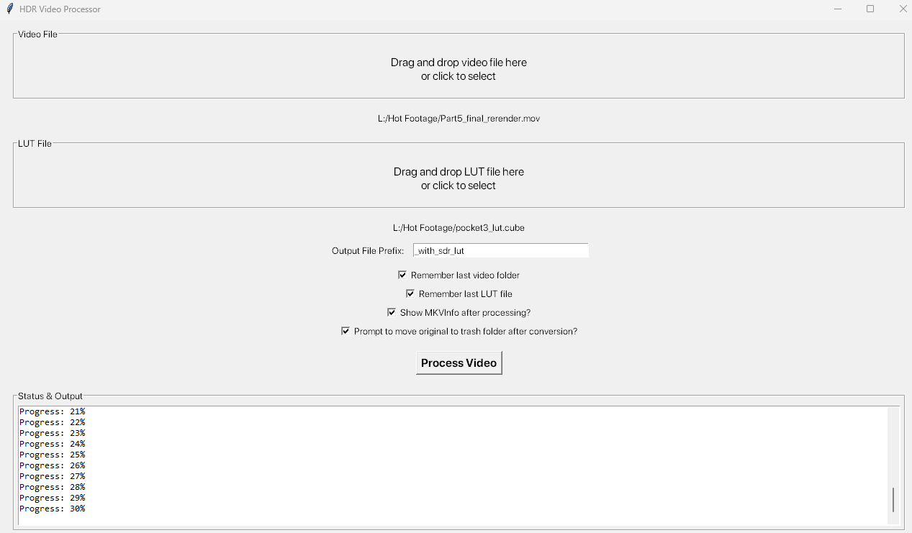

# GUI Version
A Python GUI version of the YouTube HDR metadata tool



Requires Python 3.10.x installed.

Should work on Windows, MacOS, and Linux.

# Usage
install_dependencies.bat or .sh

THEN

run_gui.bat or run_gui.sh

Enjoy~!

# Matroska Colour Metadata Ingestion Utility

The utilities provided in this repository can be used to ingest colour metadata
into matroska containers. This tool is derived from on the open source project
[MKVToolNix](https://github.com/mbunkus/mkvtoolnix). 
For more details about thecolour metadata in Matroska or WebM containers, 
see [here](http://www.webmproject.org/docs/container/#location-of-the-colour-element-in-an-mkv-file)
and [here](http://www.webmproject.org/docs/container/#colour).

Two utilities are provided
* mkvmerge is used to ingest colour metadata into matroska containers.
* mkvinfo can be used to review the metadata of a matroska file and to confirm
  the metadata is correctly ingested.

Binaries of the two utilities are provided for Windows and MacOS.
* On Windows
  * Use the 32bits executables from [/windows/32bits](/windows/32bits) for running on i686 CPUs
  * Use the 64bits executables from [/windows/64bits](/windows/64bits) for running on x86 CPUs.
* On MacOS
  * Use the mkvmerge.app and mkvinfo.app from [/macos](/macos) 

# Ingest metadata with `mkvmerge` 
* On Windows
  * run mkvmerge.exe from command line console
* On MacOS
  * Please do not click the apps. Open a terminal and run mkvmerge from the mkvmerge.app folder as
  ```
  ./mkvmerge.app/Contents/MacOS/mkvmerge ...
  ```

The complete manual about the command line can be found [here](https://mkvtoolnix.download/doc/mkvmerge.html).
You may also get the list of all flags by runing `mkvmerge -help`. 
For example, to ingest color metadata into a video named input.mov, you may use
the following command.
```shell
 ./src/mkvmerge \
      -o output.mkv\
      --colour-matrix 0:9 \
      --colour-range 0:1 \
      --colour-transfer-characteristics 0:16 \
      --colour-primaries 0:9 \
      --max-content-light 0:1000 \
      --max-frame-light 0:300 \
      --max-luminance 0:1000 \
      --min-luminance 0:0.01 \
      --chromaticity-coordinates 0:0.68,0.32,0.265,0.690,0.15,0.06 \
      --white-colour-coordinates 0:0.3127,0.3290 \
      input.mov 
```
Then the metadata will be written to output.mkv file. 

# (Optional) Attaching 3D Look-Up Table
If you want to specify a 3D Look-Up Table (LUT) as the hint to YouTube's SDR
downconversion, adding the following flags to the command line will do the job.
```
--attachment-mime-type application/x-cube \
--attach-file path-to-your-look-up-table
```


# (Optional) Review ingested with `mkvinfo` 
* On Windows
  * run mkvinfo.exe from command line console
* On MacOS
  * run mkvinfo in the mkvmerge.app folder from terminal as
  ```
  ./mkvinfo.app/Contents/MacOS/mkvmerge ...
  ```
To check the metadata of output file, you may run ./mkvinfo out.mkv to get the
following results (only colour metadata is shown below):
```
...
|  + Video track
|   + Pixel width: 3840
|   + Pixel height: 2160
|   + Display width: 3840
|   + Display height: 2160
|   + Video colour information
|    + Colour matrix: 9
|    + Colour range: 1
|    + Colour transfer: 16
|    + Colour primaries: 9
|    + Max content light: 1000
|    + Max frame light: 300
|    + Video colour mastering metadata
|     + Red colour coordinate x: 0.68
|     + Red colour coordinate y: 0.32
|     + Green colour coordinate x: 0.265
|     + Green colour coordinate y: 0.69
|     + Blue colour coordinate x: 0.15
|     + Blue colour coordinate y: 0.06
|     + White colour coordinate x: 0.3127
|     + White colour coordinate y: 0.329
|     + Max luminance: 1000
|     + Min luminance: 0.01
...
```
# Supported input format for HDR videos
For HDR videos, YouTube supports Apple Prores, DNxHR and H264 in quicktime (.mov files) or .mp4 files with AAC audio stream. For more information please see [here] (https://docs.google.com/document/d/1Di6hBotHO_Xb02o50Rp8BxGJ__XjJz88dwFWY9TVDG8/edit).

# Drag and Drop App for MAC OS
You may download the pywrapmkvmerge.app in [/macos](/macos) and drag a `.mov` file to the app. Two metadata ingested video will be automatically generated. One video is named as `*_PQ.mkv`, which is created with the command line above. The other video is named as `*_HLG.mkv`, which is created using the same command but with `--colour-transfer-characteristics = 0:18`.

If you want to specify a 3D Look-Up Table (LUT) as the hint to YouTube's SDR
downconversion, select both the LUT and the HDR video, and drag and drop them on
the app. The tool will automatically attach the LUT to the generated `*.mkv`
files. Under the hood, the tool is adding the LUT as an MKV attachment with the mime-type `application/x-cube`. 

Note that the user MUST name the LUT file with a `.cube` extension to inform the app the file is a look up table.
